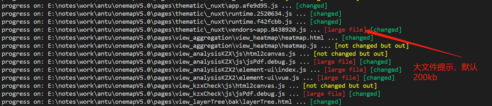

# onemap-version
  onemap版本控制
## 安装依赖
  1. ```npm install```
## 修改项目配置 gulpfile.js
```js
var config = {
  // 项目根路径
  // srcRoot: 'test/',
  // // 输出路径
   outRoot: 'dist/',
  // outRoot:"E:\\notes\\notes\\software\\apache-tomcat-8.5.57\\webapps\\space\\WEB-INF\\classes\\",
  srcRoot:'E:/notes/work/antu/onemapV5.0/',
  // 匹配符
  srcPattern: ['**/*.html', '**/*.js', '!**/plugin/**/*','!**/thirdpart/**/*','!**/_nuxt/commons/**/*'],
  // 是否zip包输出
  outZipEnable: true,
  // 极简模式，true: 只输出srcPattern匹配的文件
  outAllRepDisable: false
}
var options = {
  //参数名称
  paramName: '_',
  //文件后缀
  suffix: ['css', 'js', 'html'],
  // 参数替换还是追加replace append
  mode: 'append',
  // version  guid timestamp
  paramType: 'timestamp',
  // 匹配模式为 xx [=|+|:] xx/xx.[suffix]
  assignSymbols: ["=",":","+"],
  // 只输出内容被修改的文件
  onlyOutChanged:config.outAllRepDisable,
  // 需要排除不添加版本号的链接（针对某些链接添加版本号参数会带来额外影响）
  excludeLinks:['bootstrap-material-design.min.css'],
  // 大文件提示 单位：kb
  largeSize:200,
  // 自动跳过大文件
  autoSkipLargeFile:false
}
```
## 运行 ```gulp``` 
